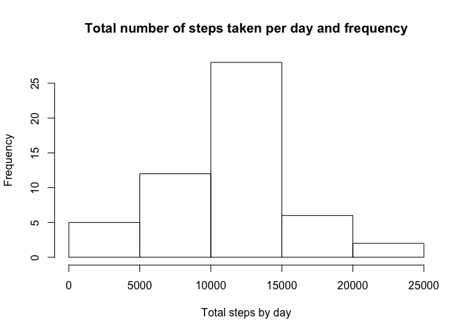
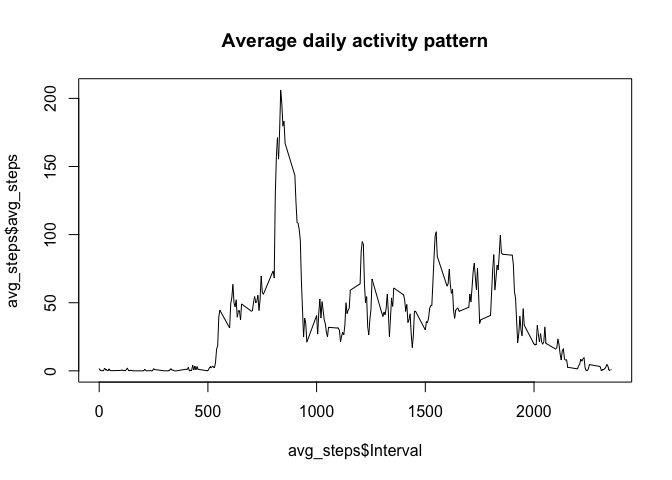
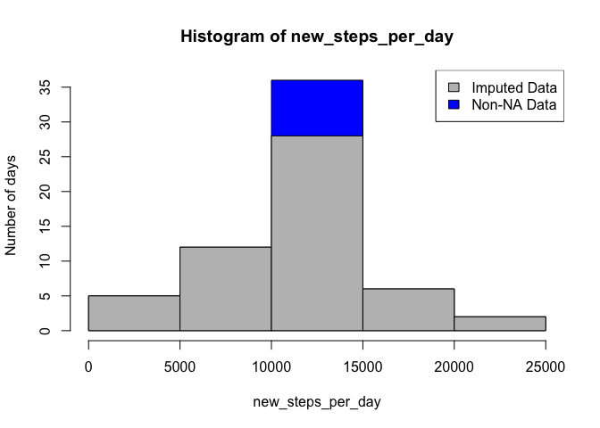
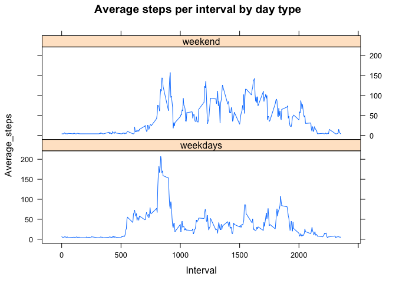

## Loading and preprocessing the data

```r
library(dplyr)
```

```
## 
## Attaching package: 'dplyr'
```

```
## The following objects are masked from 'package:stats':
## 
##     filter, lag
```

```
## The following objects are masked from 'package:base':
## 
##     intersect, setdiff, setequal, union
```

```r
library(datasets)
library(ggplot2)
library(tibble)
library(lattice)

filename <- "activity.csv"
activity <- read.csv(filename)
dim(activity)
```

```
## [1] 17568     3
```

```r
head(activity)
```

```
##   steps       date interval
## 1    NA 2012-10-01        0
## 2    NA 2012-10-01        5
## 3    NA 2012-10-01       10
## 4    NA 2012-10-01       15
## 5    NA 2012-10-01       20
## 6    NA 2012-10-01       25
```

```r
summary(activity)
```

```
##      steps                date          interval     
##  Min.   :  0.00   2012-10-01:  288   Min.   :   0.0  
##  1st Qu.:  0.00   2012-10-02:  288   1st Qu.: 588.8  
##  Median :  0.00   2012-10-03:  288   Median :1177.5  
##  Mean   : 37.38   2012-10-04:  288   Mean   :1177.5  
##  3rd Qu.: 12.00   2012-10-05:  288   3rd Qu.:1766.2  
##  Max.   :806.00   2012-10-06:  288   Max.   :2355.0  
##  NA's   :2304     (Other)   :15840
```

## What is mean total number of steps taken per day?

```r
steps_per_day <- tapply(activity$steps,activity$date, FUN=sum, rm.na = TRUE)

hist(steps_per_day, main = "Total number of steps taken per day and frequency", xlab = "Total steps by day")
```

<!-- -->

```r
steps_mean <- mean(steps_per_day, na.rm = TRUE)
steps_median <- median(steps_per_day, na.rm = TRUE)
cat("Mean of the total number of steps per day is ", steps_mean)
```

```
## Mean of the total number of steps per day is  10767.19
```

```r
cat("Median of the total number of steps per day is ", steps_median)
```

```
## Median of the total number of steps per day is  10766
```

## What is the average daily activity pattern?

```r
avg_steps<-with(activity,tapply(steps,interval,mean,na.rm=TRUE))
avg_steps <- as.data.frame(avg_steps)

avg_steps <- avg_steps %>% rownames_to_column(var = "Interval")
plot(avg_steps$Interval, avg_steps$avg_steps, type = "l", main = "Average daily activity pattern")
```

<!-- -->


## Imputing missing values

```r
rownum <- which.max(avg_steps$avg_steps)
max <- avg_steps[rownum, "avg_steps"]
sum(is.na(activity$steps))
```

```
## [1] 2304
```

```r
fill <- mean(avg_steps$avg_steps)
new_activity <- activity
count <- nrow(new_activity)
for(i in 1:count){
  if(is.na(new_activity$steps[i])) {
     new_activity$steps[i] <- fill
  }
}
```


```r
new_steps_per_day <- tapply(new_activity$steps, new_activity$date, FUN=sum)

hist(new_steps_per_day, ylab = "Number of days", col = "Blue")
hist(steps_per_day, xlab = "Total steps by day", col = "Grey", add = T)
legend("topright", c("Imputed Data", "Non-NA Data"), fill=c("grey", "blue") )
```

<!-- -->

```r
steps_mean <- mean(new_steps_per_day, na.rm = TRUE)
steps_median <- median(steps_per_day, na.rm = TRUE)
cat("Mean of the total number of steps per day after filling NA with an average number of steps is ", steps_mean)
```

```
## Mean of the total number of steps per day after filling NA with an average number of steps is  10766.19
```

```r
cat("Median of the total number of steps per day after filling NA with an average number of steps is ", steps_median)
```

```
## Median of the total number of steps per day after filling NA with an average number of steps is  10766
```
## Are there differences in activity patterns between weekdays and weekends?

```r
new_activity$date <- as.Date(new_activity$date)
new_activity <- mutate(new_activity, Weekdays = weekdays(new_activity$date))


weekdays1 <- c('Monday', 'Tuesday', 'Wednesday', 'Thursday', 'Friday')
new_activity$Weekdays <- c('weekend', 'weekday')[(weekdays(new_activity$date) %in% weekdays1)+1L]
```


```r
wkdays <- filter(new_activity, Weekdays == "weekday")
wkdays_avg_steps <- tapply(wkdays$steps, wkdays$interval, FUN=mean)
wkdays_avg_steps <- as.data.frame(wkdays_avg_steps)

wkdays_avg_steps <- wkdays_avg_steps %>% rownames_to_column(var = "Interval")
#plot(wkdays_avg_steps$Interval, wkdays_avg_steps$wkdays_avg_steps, type = "l", xlab = "Intervals", ylab = "Average Steps",main = "Weekdays")
wkdays_avg_steps <- mutate(wkdays_avg_steps, Week = "weekdays")
```


```r
wkends <- filter(new_activity, Weekdays == "weekend")
wkends_avg_steps <- tapply(wkends$steps, wkends$interval, FUN=mean)
wkends_avg_steps <- as.data.frame(wkends_avg_steps)

wkends_avg_steps <- wkends_avg_steps %>% rownames_to_column(var = "Interval")
#plot(wkends_avg_steps$Interval, wkends_avg_steps$wkends_avg_steps, type = "l", xlab = "Intervals", ylab = "Average Steps",main = "Weekend")
wkends_avg_steps <- mutate(wkends_avg_steps, Week = "weekend")

colnames(wkdays_avg_steps) <- colnames(wkends_avg_steps) <- c("Interval", "Average_steps", "Week")
week_average <- rbind(wkdays_avg_steps, wkends_avg_steps)

week_average$Interval <- as.numeric(week_average$Interval)
week_average$Average_steps <- as.integer(week_average$Average_steps)
```


```r
xyplot(Average_steps~Interval|Week, type="l", data=week_average, layout = c(1,2), main = "Average steps per interval by day type")
```

<!-- -->


Install.packages(“knitr”)
Library(“knitr”)
knit2html("/Users/masamiyamaguchi/Documents/GitHub/RepData_PeerAssessment1/PA1_template.Rmd", spin(knit = FALSE), force_v1 = TRUE)
